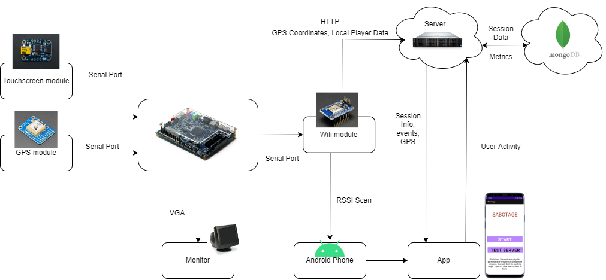
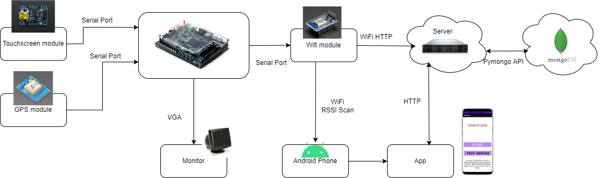
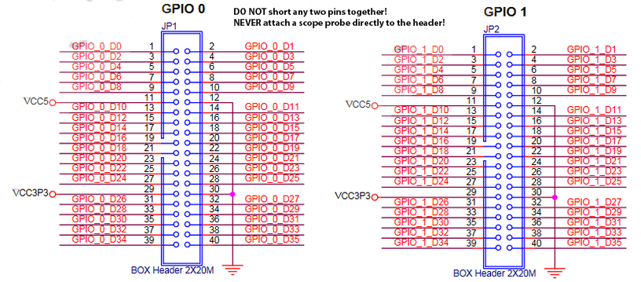

# Sabotage
This repository is for our game called **Sabotage**. The game is an Android app that uses GPS to direct you to a game
session with a hidden De1-SoC board. This GPS location is "general" and imprecise. Once you're in the general vicinity,
you’ll play "hot or cold" to pinpoint the precise location of the De1 using proximity detection implented with WiFi RSSI.
You’d play hot or cold by clicking the button on the app to ping “hot or cold”. In this “hot or cold” stage, other
players can act as saboteurs to interfere with your progress by, for example, giving you false information. Once you
find the De1-SoC board, you verify your find by entering your user ID on the De1-SoC's touchscreen, where your result
will be added to the leaderboard. Your score will be based on how long it took and how many saboteurs you overcame.



## Reports
Under [Reference Documents/Reports](Reference%20Documents/Reports), are the reports the team made describing our
individual contributions to, and the implementation details of, this project.

## Structure

The De1-SoC is is integrated with our hardware modules via serial ports instantiated using Qsys' RS232 serial core
(more on that in the [Hardware section](#other-hardware)). The VGA is also connected using a Qsys module. Our remote
server communications are all handled via WiFi and HTTP/HTTPS standard requests.

## Installation and How to Run

### Server
Our server was developed with Python 3.8.10 on Ubuntu 20.04 LTS.

Install Python packages:
```
pip install requirements.txt
```
Go to the [server directory](Server/) and enter `python3 server.py -i <ip address> -p <port number>`.
For example, enter `python3 server.py -i localhost -p 8000`. More details on how our backend and database is structured,
as well as how to test, can be found in the [README](Server/README.md) of this directory as well.

**IMPORTANT**: You will need to modify the destination URL of the `Pymongo.client` function to suit your own database.
This pertains to the following files:
* [server.py](server/server.py)
* [set_session.py](server/set_session.py)
* [Test_Client.py](Testing/Server/Test_Client.py)
* [InitDB.py](Testing/Server/InitDB.py)

### Hardware

[Source](https://people.ece.cornell.edu/land/courses/ece5760/DE1_SOC/GPIO_headers.png)
#### WiFi Module
The ESP8266 WiFi module was configured differently from our other hardware modules. It is programmed using the
[Arduino IDE](https://www.arduino.cc/en/software). For more details, we used
[this tutorial from Adafruit](https://learn.adafruit.com/adafruit-huzzah-esp8266-breakout/using-arduino-ide).
Before programming the MCU, you will need to change the 
[`remoteServer variable`](https://github.com/UBC-CPEN391/l2b-11-sabotage/blob/main/Hardware/WiFi_Module/WiFi_Module.ino#L10)
to the URL where your server can be found. The `ssid` and `password` variables will also need to be changed to suit your
own WiFi network. After programming, just connect 3.3V power from the De1-SoC's GPIO along with
`GPIO_0_D31` to the `RX` pin on the ESP8266.

#### Other Hardware
The other hardware modules were configured to be used with the De1-SoC with Quartus Prime 18.1 (only Standard and Lite
edition support the De1-SoC), the included Platform Designer (Qsys) program, and the Eclipse Build Tools For Nios
(also included). We based our system on the [Intel FPGA University Monitor Program](https://fpgacademy.org/tools.html)

After installing the programs along with support for Cyclone V boards, open Qsys and generate HDL for the
`Computer_System.qsys` file. Afterwards, go to Quartus and Compile the program. This will take a while.

When you are done compiling, program your board. Then, open Eclipse and add the folders
[`sabotage/`](Hardware/rtl/software/Sabotage/) and [`sabotage_bsp/`](Hardware/rtl/software/Sabotage_bsp/) to your
workspace. Generate the BSP, compile build the code, and download it onto the board.

Finally, you will need to power the GPS module using 3.3V and the touch screen module with 5V. Also plug in your VGA
screen. Connect the following pins:
* `TX` on the touchscreen module to `GPIO_0_D28`
* `RX` on the touchscreen module to `GPIO_0_D29`
* `TX` on the GPS module to `GPIO_0_D34`
* `RX` on the GPS module to `GPIO_0_D35`

### Mobile App
See the [App README](App/README.md)

## Branch Naming Convention

Branch naming convention: **type**-**issueID**-**desc**

**type**: Used to identify the purpose of this branch. The different types have been listed below:

- wip - works in progress; stuff I know won't be finished soon
- feat - feature I'm adding or expanding
- bug - bug fix or experiment
- junk - throwaway branch created to experiment

**issueID**: This is a unique Id that identifies each issue. Can be found next to the issue name (Number that is 
preceded by a ‘#’).

Note: Use three digits numbers eg: #7 would be 007

**desc**: a short description about the issue. If two or more words are needed, use ‘\_’ to separate them.
